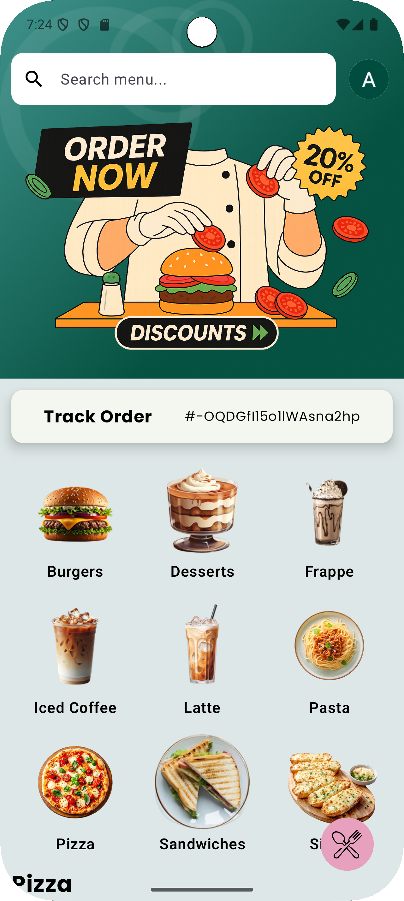
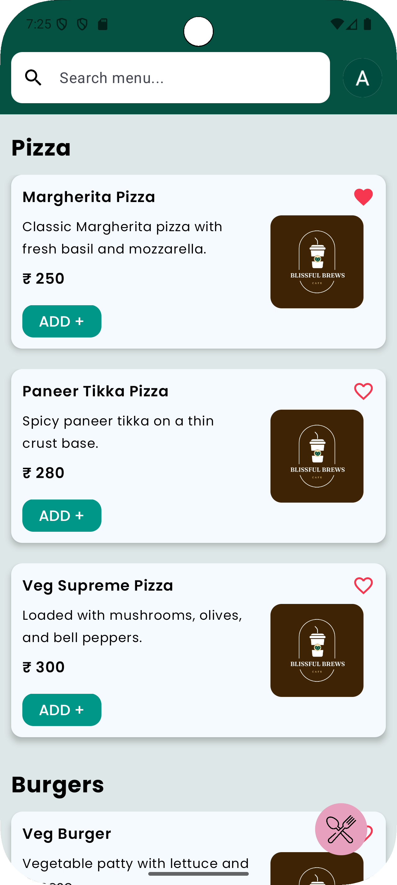
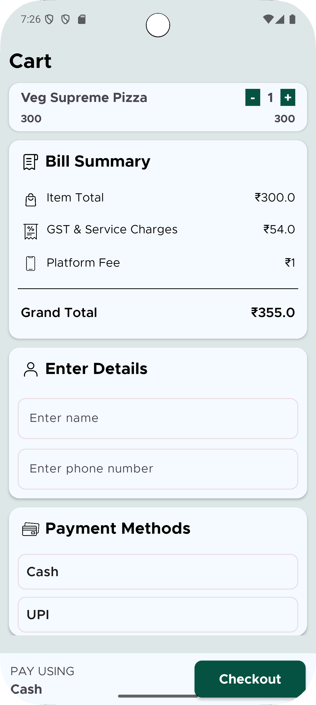
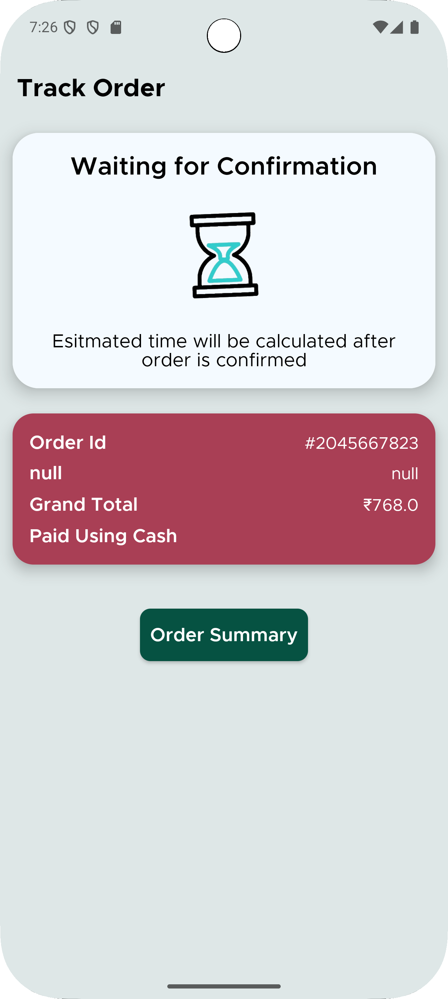
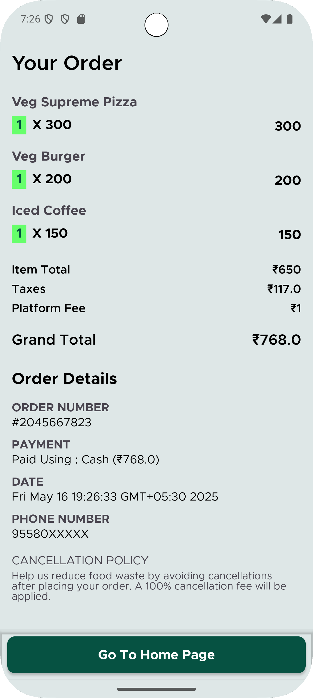
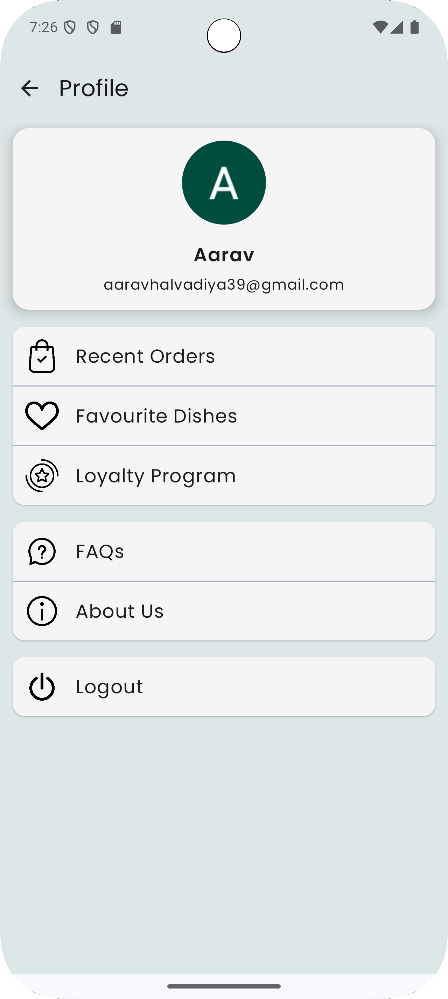
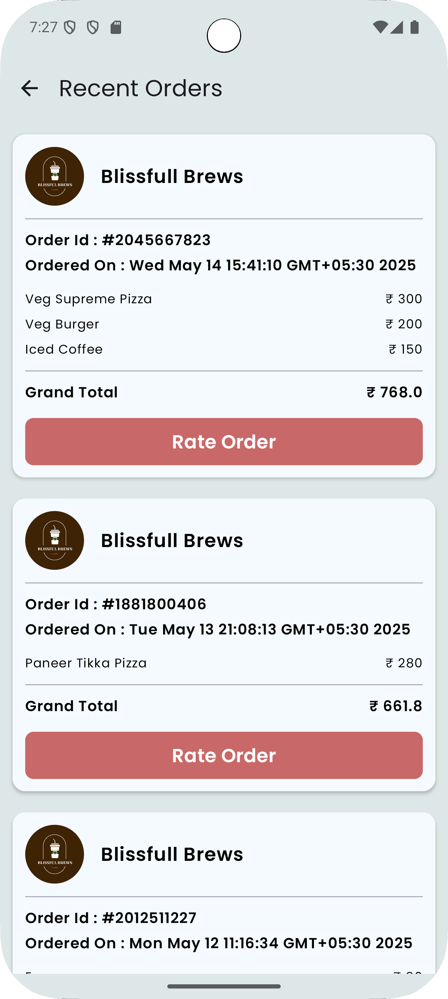
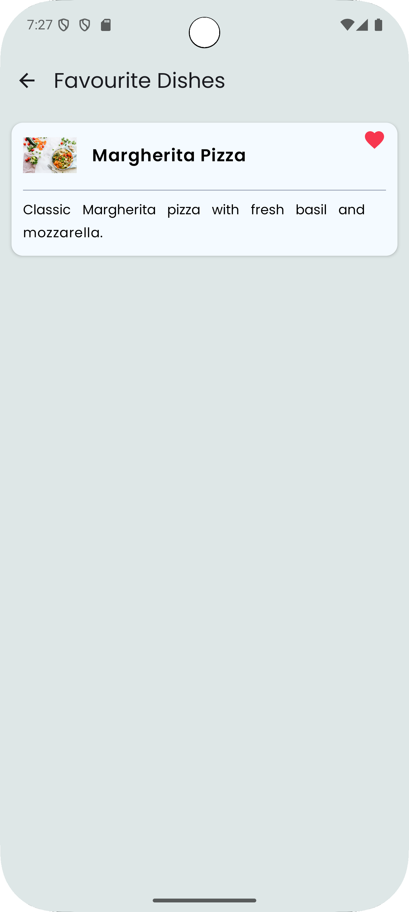

# Blissful Brews - Cafe Ordering System

**Blissful Brews** is a cafe ordering system app that allows customers to browse through a menu, add items to the cart, modify the cart, and proceed to checkout. This project leverages **Firebase** for real-time data synchronization and **Glide** for image loading, ensuring a smooth and responsive experience.

## Features

- **Cart Management**: Users can add, update, and remove items from their cart before checkout.
- **Menu Management**: Fetches menu items dynamically from Firebase Realtime Database.
- **User Authentication**: Users can sign in or register using Firebase Authentication to keep their cart saved.
- **Real-time Data Sync**: The Firebase Realtime Database ensures the data is synced across all devices instantly.
- **Order Processing**: Once the order is confirmed, the system updates the Firebase database, showing real-time updates for order status.

## Technologies Used

- **Frontend**: Jetpack Compose & XML
- **Backend**: Firebase (Authentication, Realtime Database)
- **Image Loading**: Glide
- **Dependency Injection**: Dagger-Hilt
- **Navigation**: Navigation Component
- **State Management**: ViewModel, LiveData
- **Database**: Firebase Realtime Database

## Screenshots

  
  
  

 

  
  
  

 

  
  

## Project Structure

- **Firebase Setup**: 
  - Firebase Authentication: Used to manage user sign-up and login.
  - Firebase Realtime Database: Stores the menu items and order data.

- **UI Implementation**: 
  - Utilized Jetpack Compose to build a responsive and dynamic UI.
  - The cart system allows users to interact with the menu and modify their selections before proceeding to checkout.

- **Image Loading**: 
  - Integrated **Glide** for efficient and smooth image loading of menu items.

## Features to Implement/Enhance (Future Work)

### 1. **Add Order History for Users to View Previous Orders**
   - **Current Status**: The app currently allows users to place new orders, but there is no feature to view past orders.
   - **Enhancement Plan**: Implement a system where users can view a list of their previous orders. This would involve storing order data (such as order details, timestamps, and status) in Firebase Realtime Database and displaying them in a new "Order History" section of the app.

### 2. **Improve UI/UX with Animations and Smooth Transitions**
   - **Current Status**: The current UI offers basic navigation and interaction.
   - **Enhancement Plan**: Enhance the user interface by adding animations and smooth transitions to improve the overall user experience. For example:
     - Implementing animated transitions between screens.
     - Adding animations to cart operations (e.g., adding/removing items).
     - Improving button and interaction animations to make the app feel more dynamic and modern.

### 3. **Integrate Push Notifications for Order Status Updates**
   - **Current Status**: Currently, there are no notifications for order updates.
   - **Enhancement Plan**: Integrate Firebase Cloud Messaging (FCM) to send push notifications to users for order status updates. For example:
     - Notify users when their order has been placed, is being prepared, or has been completed.
     - Use FCM to send real-time updates on the status of their orders, ensuring users are always informed.
     - Implement an option to opt in/out of push notifications based on user preferences.

These enhancements will help take the app to the next level, improving its functionality and user experience.

